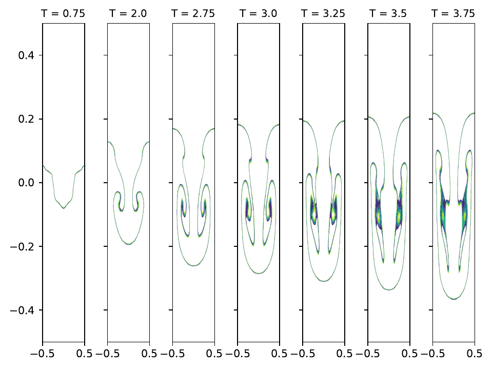

# ns2div

ns2div is a GPU accelerated solver for Navier-Stokes equations with variable density based on 
Density variable Navier-Stokes code with GPU acceleration on rectangular structured meshes. The code is related to the paper:

> Monica Dessole, Fabio Marcuzzi "**[Fully iterative ILU preconditioning of the unsteady Navier–Stokes equations for GPGPU](https://www.sciencedirect.com/science/article/pii/S0898122118306345?via%3Dihub)**", Computers & Mathematics with Applications
Volume 77, Issue 4, 15 February 2019, Pages 907-92.



The numerical scheme implemented is based on the <a role="button" href="https://wikis.univ-lille.fr/painleve/ns2ddv">NS2DDV Matlab toolbox</a>. Strang splitting is used to decouple the transpost problem concerning the density the from the Navier-Stokes problem, describing the velocity and the pressure of the fluid. The former is treated with a Finite Volume scheme, in the latter a second-order Finite Element projection scheme is used to decouple the pressure and the components of the velocity field, each of them is obtained by solving s sparse linear system with GMRES with an LU type preconditioner which is updated with the Simplified ITALU procedure. 

## Running ns2div

In order to run a test one shoud execute the file `test_profile.py` with the inputs `nbseg_x` (number of mesh intervals in the x-direction), `nbseg_y` (number of mesh intervals in the y-direction), `BENCHMARK` (EXAC, RTIN or DROP). For example
```console
python test_profile.py 8 8 EXAC
```
run the exact test case on a 8x8 structured mesh.

In order to compute the convergence order one can run
```console
python test_convergence.py 
```
## Manual setup

One can make the following changes in the file `manual_setup.py` in order to set the following variables:
- test_output = 0 (1 enable output data storage at each time step), 0 (output data storage disabled)
- ns.test_plot = 0 (1 enable plot making in RTIN or DROP test cases), 0 (plots disabled)
- ns.prec =  0 (no preconditioner), 1  (diagonal preconditioner), 2 (ILU(0) preconditioner)
- iterLU = 1 (enable ILU(0) with ITALU updates), 0 (ITALU disabled)
    - ns.initialize_LU = 0 (0 initialize L,U con ILU(0)), 1 (inizialize L,U con tril,triu)
    - ns.iters = 1 (number of ITALU iterations)
    - ns.ITALU_update_param = k (if k > 1, the ITALU procedure is applied every k iterations) 
    
    Parameters for L/U triangular linear systems solution in the application of the preconditioner
    - ns.LU_scalar_jacobi = 0 (direct solver), 1 (Jacobi iterative solver)
    - ns.LU_block_jacobi = 0 (direct solver), 1 (Block Jacobi iterative solver)
    - ns.LUit_iters = 3 (number of Jacobi iterations)
    - ns.approx_diag_LU = 0 (band approximation disabled), 1 (enable approximation of L/U by a band matrix)
    - ns.diag = 3 (desired bandwidth) 
    - ns.cutDAG_LU = 0 (DAG cutting disabled), 1 (enable DAG cutting)
    - ns.cut = 1/2 (percentage between 0 and 1 of levels to be deleted from the DAG of L/U)

    
